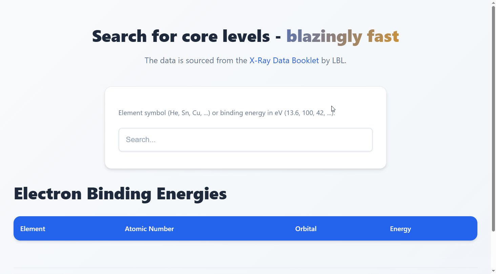

# XPS Helper

A simple, fast web application for looking up core level binding energies used in X-ray Photoelectron Spectroscopy (XPS) analysis.

## What is it?

This app provides quick access to electron binding energy data for elements and their orbitals. Whether you're doing XPS analysis in the lab or just need to reference binding energies, this tool makes it easy to find what you're looking for.

## Features

- **Element Search**: Search by element symbol (e.g., He, Sn, Cu)
- **Energy Range Search**: Search by binding energy in eV with customizable width
- **Fast & Responsive**: Built with Go and HTMX for fast results

## Try it out

Visit the live version at **[xps.matthewstaab.com](https://xps.matthewstaab.com)**

## Data Source

The binding energy data is sourced from the [X-Ray Data Booklet](https://xdb.lbl.gov/Section1/Sec_1-1.html) by Lawrence Berkeley National Laboratory (LBL).

## How to use

1. **Search by element**: Enter an element symbol like "Fe" or "Au"
2. **Search by energy**: Enter a binding energy in eV (e.g., "13.6") and optionally specify a search width
3. Results appear instantly as you type

## Demo

---

Created by [Matthew Staab](https://github.com/mstaab16)